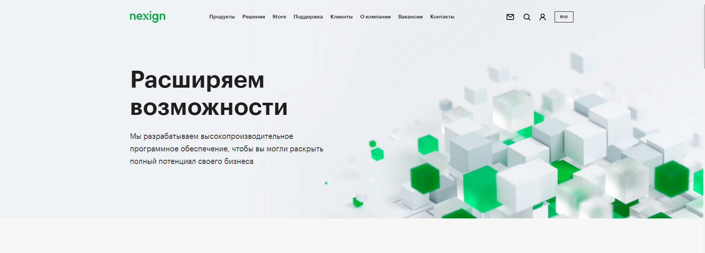
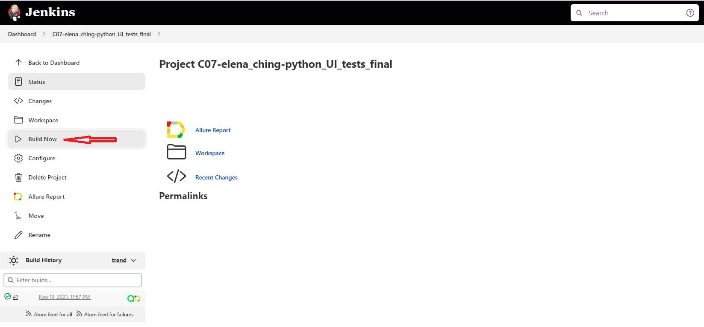
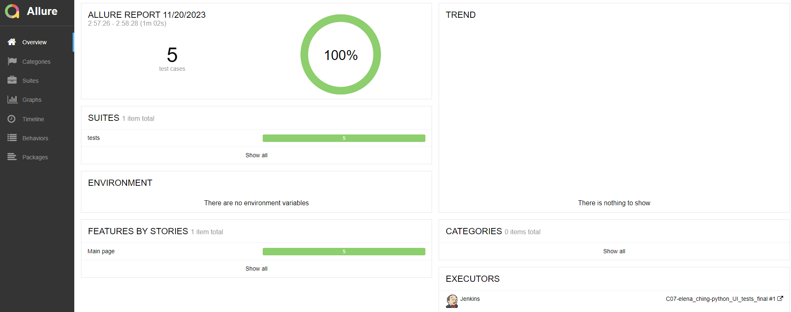
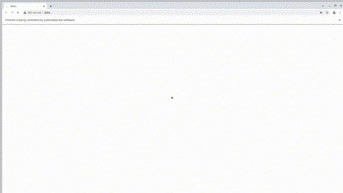
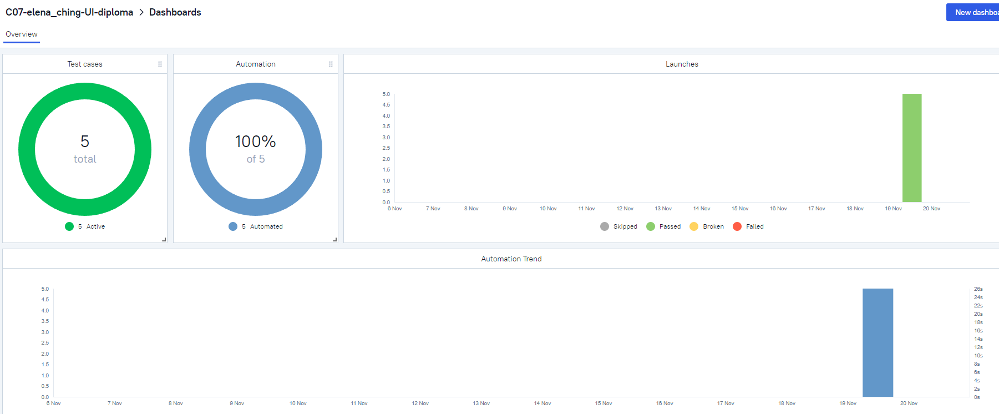
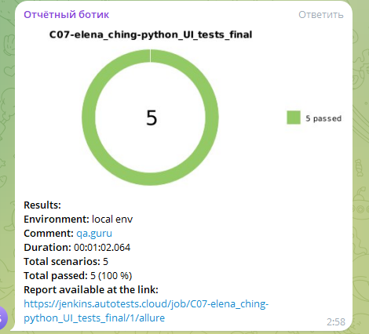

# Проект по тестированию главной страницы сайта *[nexign.com](https://nexign.com/)*

## Список проверок
 - Проверка перехода на страницу *Контакты*;
 - Проверка перехода на домашнюю страницу через логотип;
 - Проверка сменяемости языка;
 - Проверка наличия пунктов меню;
 - Проверка функции поиска статей.

## Технoлoгии и инструмeнты

## Запуск автотестов в Jenkins
#### 1. Открыть <a target="_blank" href="https://jenkins.autotests.cloud/job/C07-elena_ching-python_unit15/">проект</a>
#### 2. Нажать **Build Now**

#### 3. Результат запуска сборки можно посмотреть в отчёте Allure

### Пример видеозаписи прохождения теста

# Интеграция с Allure TestOps и Telegram
### Результаты прохождения тестов, а также сами тест-кейсы будут отправлены в Allure TestOps

### Настроено автоматическое оповещение о результатах сборки Jenkins в Telegram
 